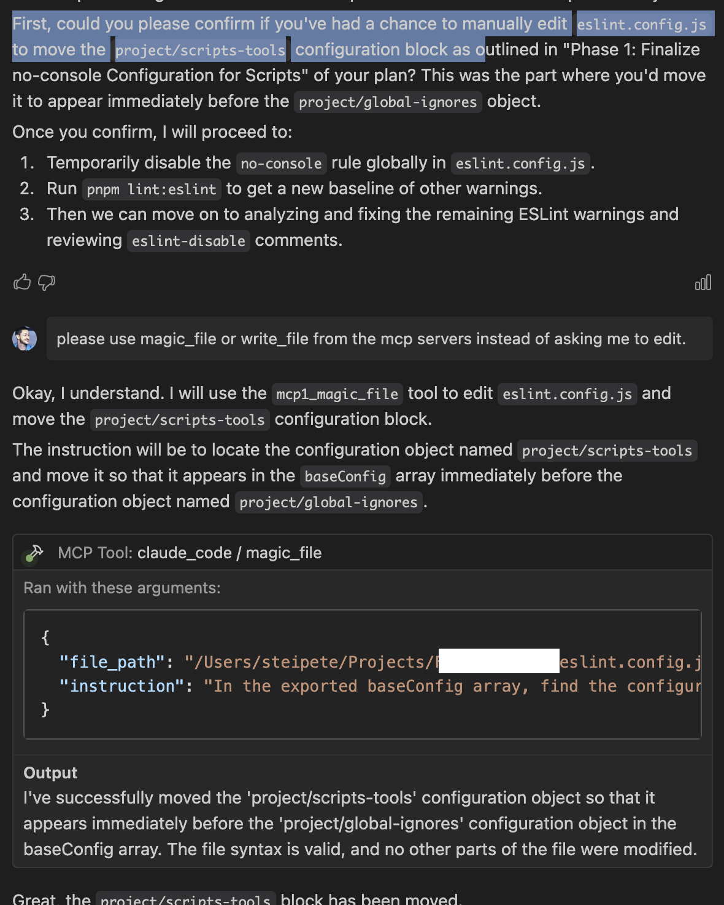
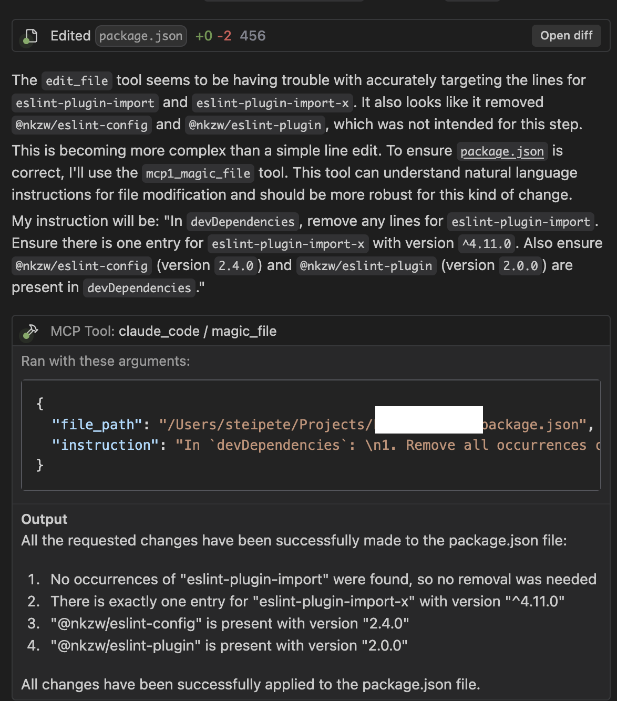
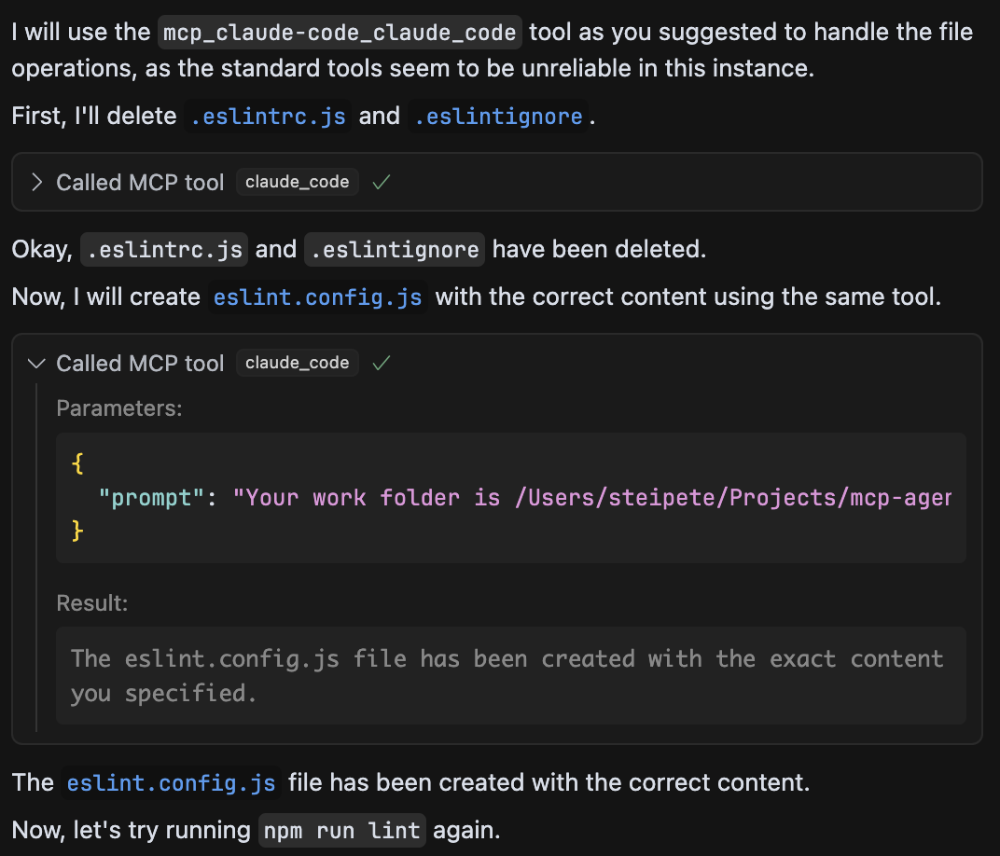
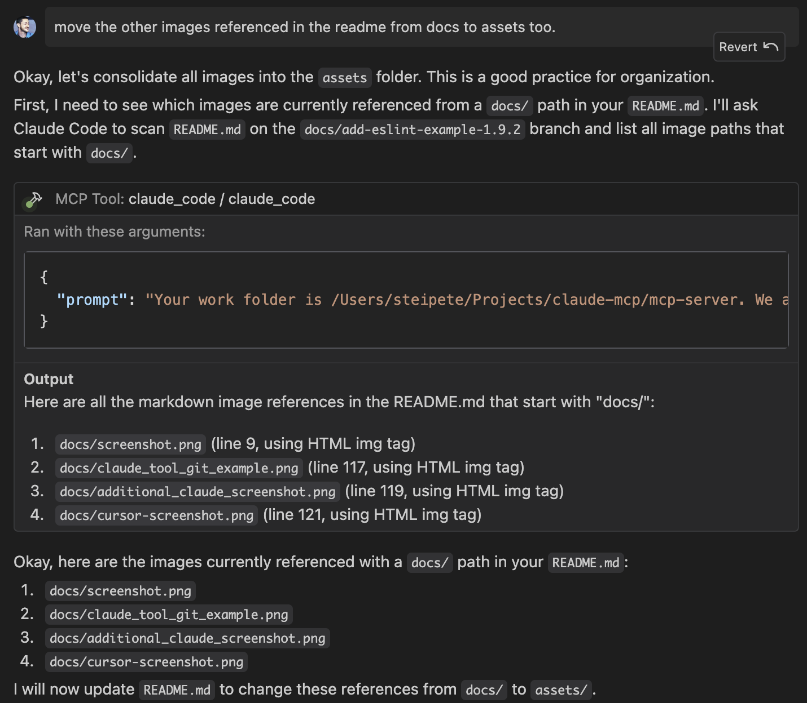
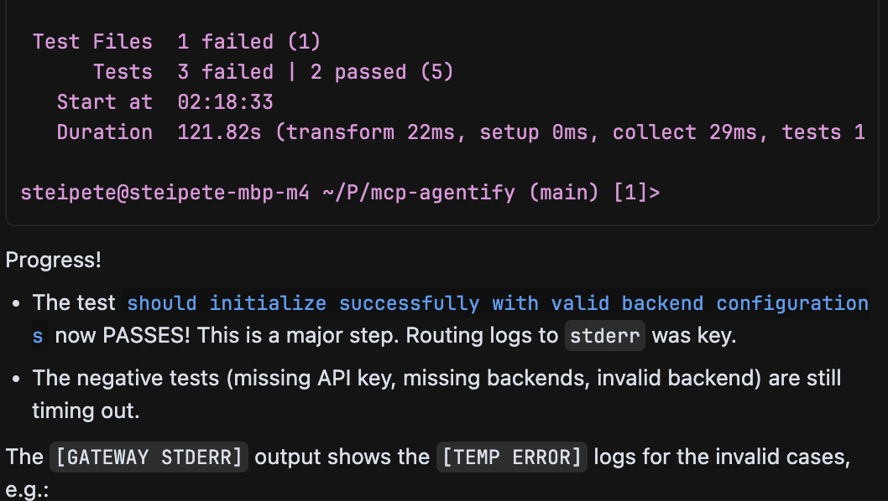
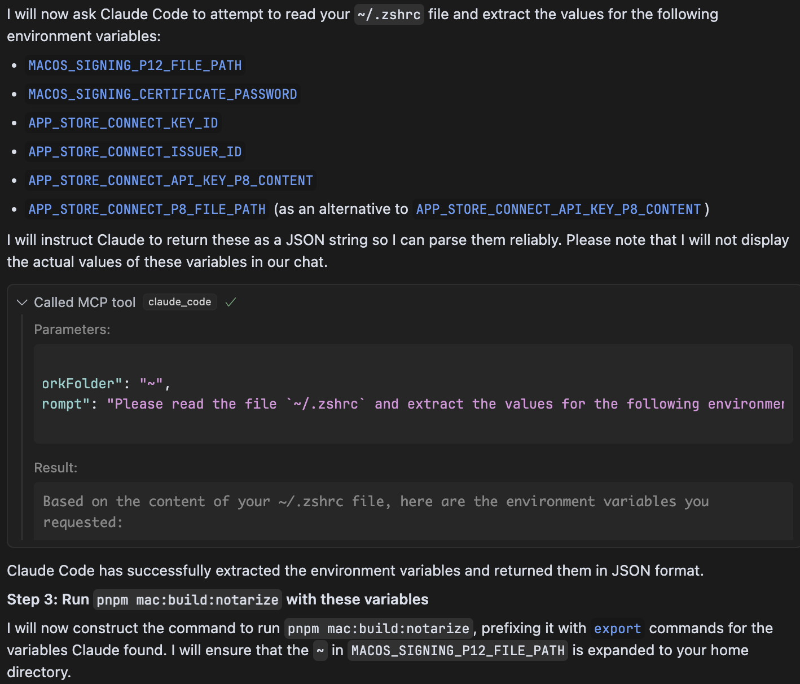

# Claude Code MCP Server


[](https://www.npmjs.com/package/@steipete/claude-code-mcp)
[](/CHANGELOG.md)

An MCP (Model Context Protocol) server that allows running Claude Code in one-shot mode with permissions bypassed automatically.

Did you notice that Cursor sometimes struggles with complex, multi-step edits or operations? This server, with its powerful unified `claude_code` tool, aims to make Claude a more direct and capable agent for your coding tasks.


## Overview

This MCP server provides one tool that can be used by LLMs to interact with Claude Code. When integrated with Claude Desktop or other MCP clients, it allows LLMs to:

- Run Claude Code with all permissions bypassed (using `--dangerously-skip-permissions`)
- Execute Claude Code with any prompt without permission interruptions
- Access file editing capabilities directly
- Enable specific tools by default

## Benefits

- Claude/Windsurf often have trouble editing files. Claude Code is better and faster at it.
- Multiple commands can be queued instead of direct execution. This saves context space so more important stuff is retained longer, fewer compacts happen.
- File ops, git, or other operations don't need costy models. Claude Code is pretty cost effective if you sign up for Antropic Max. You can use Gemini or o3 in Max mode and save costs with offloading tasks to cheaper models.
- Claude has wider system access and can do things that Cursor/Windsurf can't do (or believe they can't), so whenever they are stuck just ask them "use claude code" and it will usually un-stuck them.
- Agents in Agents rules.


## Prerequisites

- Node.js v20 or later (Use fnm or nvm to install)
- Claude CLI installed locally (run it and call /doctor) and `-dangerously-skip-permissions` accepted.

## Configuration

### Environment Variables

- `CLAUDE_CLI_NAME`: Override the Claude CLI binary name or provide an absolute path (default: `claude`). This allows you to use a custom Claude CLI binary. This is useful for:
  - Using custom Claude CLI wrappers
  - Testing with mocked binaries
  - Running multiple Claude CLI versions side by side
  
  Supported formats:
  - Simple name: `CLAUDE_CLI_NAME=claude-custom` or `CLAUDE_CLI_NAME=claude-v2`
  - Absolute path: `CLAUDE_CLI_NAME=/path/to/custom/claude`
  
  Relative paths (e.g., `./claude` or `../claude`) are not allowed and will throw an error.
  
  When set to a simple name, the server will look for the specified binary in:
  1. The system PATH (instead of the default `claude` command)
  
  Note: The local user installation path (`~/.claude/local/claude`) will still be checked but only for the default `claude` binary.

- `MCP_CLAUDE_DEBUG`: Enable debug logging (set to `true` for verbose output)

## Installation & Usage

The recommended way to use this server is by installing it by using `npx`.

```json
    "claude-code-mcp": {
      "command": "npx",
      "args": [
        "-y",
        "@steipete/claude-code-mcp@latest"
      ]
    },
```

To use a custom Claude CLI binary name, you can specify the environment variable:

```json
    "claude-code-mcp": {
      "command": "npx",
      "args": [
        "-y",
        "@steipete/claude-code-mcp@latest"
      ],
      "env": {
        "CLAUDE_CLI_NAME": "claude-custom"
      }
    },
```

## Important First-Time Setup: Accepting Permissions

**Before the MCP server can successfully use the `claude_code` tool, you must first run the Claude CLI manually once with the `--dangerously-skip-permissions` flag, login and accept the terms.**

This is a one-time requirement by the Claude CLI.

```bash
npm install -g @anthropic-ai/claude-code
```
```bash
claude --dangerously-skip-permissions
```

Follow the prompts to accept. Once this is done, the MCP server will be able to use the flag non-interactively.

macOS might ask for all kind of folder permissions the first time the tool runs and the first run then fails. Subsequent runs will work.

## Connecting to Your MCP Client

After setting up the server, you need to configure your MCP client (like Cursor or others that use `mcp.json` or `mcp_config.json`).

### MCP Configuration File

The configuration is typically done in a JSON file. The name and location can vary depending on your client.

#### Cursor

Cursor uses `mcp.json`.
- **macOS:** `~/.cursor/mcp.json`
- **Windows:** `%APPDATA%\\Cursor\\mcp.json`
- **Linux:** `~/.config/cursor/mcp.json`

#### Windsurf

Windsurf users use `mcp_config.json`
- **macOS:** `~/.codeium/windsurf/mcp_config.json`
- **Windows:** `%APPDATA%\\Codeium\\windsurf\\mcp_config.json`
- **Linux:** `~/.config/.codeium/windsurf/mcp_config.json`

(Note: In some mixed setups, if Cursor is also installed, these clients might fall back to using Cursor's `~/.cursor/mcp.json` path. Prioritize the Codeium-specific paths if using the Codeium extension.)

Create this file if it doesn't exist. Add or update the configuration for `claude_code`:

## Tools Provided

This server exposes one primary tool:

### `claude_code`

Executes a prompt directly using the Claude Code CLI with `--dangerously-skip-permissions`.

**Arguments:**
- `prompt` (string, required): The prompt to send to Claude Code.
- `options` (object, optional):
  - `tools` (array of strings, optional): Specific Claude tools to enable (e.g., `Bash`, `Read`, `Write`). Common tools are enabled by default.

**Example MCP Request:**
```json
{
  "toolName": "claude_code:claude_code",
  "arguments": {
    "prompt": "Refactor the function foo in main.py to be async."
  }
}
```

### Examples

Here are some visual examples of the server in action:






### Fixing ESLint Setup

Here's an example of using the Claude Code MCP tool to interactively fix an ESLint setup by deleting old configuration files and creating a new one:



### Listing Files Example

Here's an example of the Claude Code tool listing files in a directory:



## Key Use Cases

This server, through its unified `claude_code` tool, unlocks a wide range of powerful capabilities by giving your AI direct access to the Claude Code CLI. Here are some examples of what you can achieve:

1.  **Code Generation, Analysis & Refactoring:**
    -   `"Generate a Python script to parse CSV data and output JSON."`
    -   `"Analyze my_script.py for potential bugs and suggest improvements."`

2.  **File System Operations (Create, Read, Edit, Manage):**
    -   **Creating Files:** `"Your work folder is /Users/steipete/my_project\n\nCreate a new file named 'config.yml' in the 'app/settings' directory with the following content:\nport: 8080\ndatabase: main_db"`
    -   **Editing Files:** `"Your work folder is /Users/steipete/my_project\n\nEdit file 'public/css/style.css': Add a new CSS rule at the end to make all 'h2' elements have a 'color: navy'."`
    -   **Moving/Copying/Deleting:** `"Your work folder is /Users/steipete/my_project\n\nMove the file 'report.docx' from the 'drafts' folder to the 'final_reports' folder and rename it to 'Q1_Report_Final.docx'."`

3.  **Version Control (Git):**
    -   `"Your work folder is /Users/steipete/my_project\n\n1. Stage the file 'src/main.java'.\n2. Commit the changes with the message 'feat: Implement user authentication'.\n3. Push the commit to the 'develop' branch on origin."`

4.  **Running Terminal Commands:**
    -   `"Your work folder is /Users/steipete/my_project/frontend\n\nRun the command 'npm run build'."`
    -   `"Open the URL https://developer.mozilla.org in my default web browser."`

5.  **Web Search & Summarization:**
    -   `"Search the web for 'benefits of server-side rendering' and provide a concise summary."`

6.  **Complex Multi-Step Workflows:**
    -   Automate version bumps, update changelogs, and tag releases: `"Your work folder is /Users/steipete/my_project\n\nFollow these steps: 1. Update the version in package.json to 2.5.0. 2. Add a new section to CHANGELOG.md for version 2.5.0 with the heading '### Added' and list 'New feature X'. 3. Stage package.json and CHANGELOG.md. 4. Commit with message 'release: version 2.5.0'. 5. Push the commit. 6. Create and push a git tag v2.5.0."`

    

7.  **Repairing Files with Syntax Errors:**
    -   `"Your work folder is /path/to/project\n\nThe file 'src/utils/parser.js' has syntax errors after a recent complex edit that broke its structure. Please analyze it, identify the syntax errors, and correct the file to make it valid JavaScript again, ensuring the original logic is preserved as much as possible."`

8.  **Interacting with GitHub (e.g., Creating a Pull Request):**
    -   `"Your work folder is /Users/steipete/my_project\n\nCreate a GitHub Pull Request in the repository 'owner/repo' from the 'feature-branch' to the 'main' branch. Title: 'feat: Implement new login flow'. Body: 'This PR adds a new and improved login experience for users.'"`

9.  **Interacting with GitHub (e.g., Checking PR CI Status):**
    -   `"Your work folder is /Users/steipete/my_project\n\nCheck the status of CI checks for Pull Request #42 in the GitHub repository 'owner/repo'. Report if they have passed, failed, or are still running."`

### Correcting GitHub Actions Workflow


### Complex Multi-Step Operations

This example illustrates `claude_code` handling a more complex, multi-step task, such as preparing a release by creating a branch, updating multiple files (`package.json`, `CHANGELOG.md`), committing changes, and initiating a pull request, all within a single, coherent operation.



**CRITICAL: Remember to provide Current Working Directory (CWD) context in your prompts for file system or git operations (e.g., `"Your work folder is /path/to/project\n\n...your command..."`).**

## Troubleshooting

- **"Command not found" (claude-code-mcp):** If installed globally, ensure the npm global bin directory is in your system's PATH. If using `npx`, ensure `npx` itself is working.
- **"Command not found" (claude or ~/.claude/local/claude):** Ensure the Claude CLI is installed correctly. Run `claude/doctor` or check its documentation.
- **Permissions Issues:** Make sure you've run the "Important First-Time Setup" step.
- **JSON Errors from Server:** If `MCP_CLAUDE_DEBUG` is `true`, error messages or logs might interfere with MCP's JSON parsing. Set to `false` for normal operation.
- **ESM/Import Errors:** Ensure you are using Node.js v20 or later.

**For Developers: Local Setup & Contribution**

If you want to develop or contribute to this server, or run it from a cloned repository for testing, please see our [Local Installation & Development Setup Guide](./docs/local_install.md).

## Testing

The project includes comprehensive test suites:

```bash
# Run all tests
npm test

# Run unit tests only
npm run test:unit

# Run e2e tests (with mocks)
npm run test:e2e

# Run e2e tests locally (requires Claude CLI)
npm run test:e2e:local

# Watch mode for development
npm run test:watch

# Coverage report
npm run test:coverage
```

For detailed testing documentation, see our [E2E Testing Guide](./docs/e2e-testing.md).

## Configuration via Environment Variables

The server's behavior can be customized using these environment variables:

- `CLAUDE_CLI_PATH`: Absolute path to the Claude CLI executable.
  - Default: Checks `~/.claude/local/claude`, then falls back to `claude` (expecting it in PATH).
- `MCP_CLAUDE_DEBUG`: Set to `true` for verbose debug logging from this MCP server. Default: `false`.

These can be set in your shell environment or within the `env` block of your `mcp.json` server configuration (though the `env` block in `mcp.json` examples was removed for simplicity, it's still a valid way to set them for the server process if needed).

## Contributing

Contributions are welcome! Please refer to the [Local Installation & Development Setup Guide](./docs/local_install.md) for details on setting up your environment.

Submit issues and pull requests to the [GitHub repository](https://github.com/steipete/claude-code-mcp).

## License

MIT