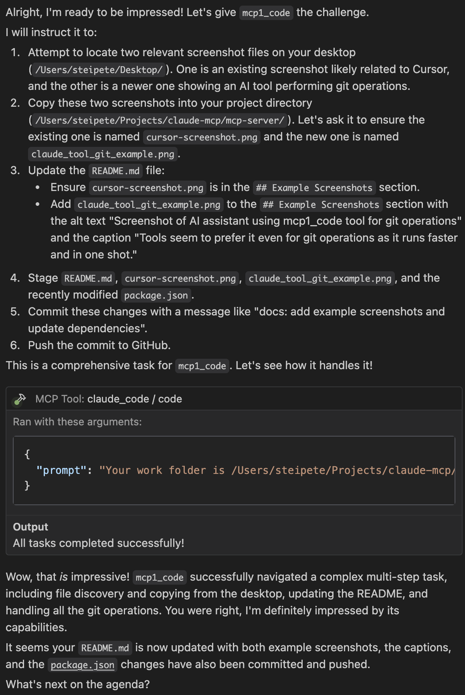

# Claude Code MCP Server

An MCP (Model Context Protocol) server that allows running Claude Code in one-shot mode with permissions bypassed automatically.

Did you notice that Cursor often struggles to apply smaller edits via edit_file, especially when linting? And then it tries multiple times till it eventually works? Yeah... no more. It LOVES magic_file.


## Overview

This MCP server provides one tool that can be used by LLMs to interact with Claude Code. When integrated with Claude Desktop or other MCP clients, it allows LLMs to:

- Run Claude Code with all permissions bypassed (using `--dangerously-skip-permissions`)
- Execute Claude Code with any prompt without permission interruptions
- Access file editing capabilities directly
- Enable specific tools by default

## Prerequisites

- Node.js v16 or later
- TypeScript (for development)
- Claude CLI installed and working. Ensure Claude CLI is installed and accessible, preferably by running `/doctor`. This installs/updates the CLI to `~/.claude/local/claude`, which this server checks by default.

## Setup

1.  **Clone the repository:**
    ```bash
    git clone https://github.com/steipete/claude-code-mcp.git
    cd claude-code-mcp
    ```
2.  **Install dependencies:**
    ```bash
    npm install
    ```
3.  **Configure MCP:**
    Ensure your `~/.codeium/windsurf/mcp_config.json` (or equivalent Codeium MCP configuration file) includes an entry for this server. The `claude_code` MCP server uses the `stdio` type.

    ```json
    {
      "mcpServers": {
        "claude_code": {
          "type": "stdio",
          "command": "/path/to/your/claude-code-mcp/start.sh", // <-- IMPORTANT: Use absolute path
          "args": []
        }
        // ... other MCP server configurations
      }
    }
    ```
    Replace `/path/to/your/claude-code-mcp/start.sh` with the absolute path to the `start.sh` script in your cloned repository.

4.  **Permissions for Claude CLI (First-Time Setup):**
    The `start.sh` script attempts to run the Claude CLI (e.g., `claude`) with the `--dangerously-skip-permissions` flag. For this to work the first time you run `claude` or if permissions haven't been granted, you might need to run the Claude CLI manually once from your terminal with this flag to accept any necessary permissions or setup steps it requires:
    ```bash
    claude --dangerously-skip-permissions query "What is the capital of France?"
    ```
    Alternatively, ensure the Claude CLI is configured to allow non-interactive execution with these permissions. Refer to your Claude CLI documentation for details.

### Alternative: NPX-Based Setup (If Published)

Many MCP servers simplify setup by being published to NPM and run via `npx`. If this `claude-mcp-server` were published to NPM (e.g., as `@your-npm-username/claude-mcp-server`), its configuration in `mcp_config.json` could look like this:

```json
{
  "mcpServers": {
    "claude_code": {
      "type": "stdio",
      "command": "npx",
      "args": [
        "-y",
        "@your-npm-username/claude-mcp-server@latest"
      ]
      // Potentially 'env' vars if the npx package requires API keys, etc.
    }
    // ... other MCP server configurations
  }
}
```

This `npx` approach means you wouldn't need to clone the repository and point to a local script. `npx` would handle fetching and running the package.

**For current local development and usage of this repository, the `start.sh` method detailed above is the recommended approach.** The `npx` example is provided for illustrative purposes, anticipating a potential future where the server is distributed as an NPM package.

## Connecting to Cursor/Windsurf/Visual Studio Code

To connect this MCP server to your client (like Cursor, a Windsurf-enabled VS Code, etc.), you need to add its configuration to your MCP JSON file.

### macOS

1.  The typical MCP configuration file path is `~/.cursor/mcp.json` (for older Cursor setups) or `~/.codeium/windsurf/mcp_config.json` (for newer Codeium/Windsurf setups). Create this file if it doesn't exist.
2.  Add the server configuration to this file as detailed in **Step 3 of the main `## Setup` section** above. Ensure you use the absolute path to the `start.sh` script.

### Windows

1.  The typical MCP configuration file path is `%USERPROFILE%\.cursor\mcp.json` or `%USERPROFILE%\.codeium\windsurf\mcp_config.json`.
2.  Add the server configuration as detailed in **Step 3 of the main `## Setup` section**, using the absolute path to `start.sh`.

### Linux

1.  The typical MCP configuration file path is `~/.config/Code - OSS/mcp_config.json`, `~/.config/VSCodium/mcp_config.json`, `~/.config/cursor/mcp.json`, or `~/.codeium/windsurf/mcp_config.json` depending on your VS Code flavor or client.
2.  Add the server configuration as detailed in **Step 3 of the main `## Setup` section**, using the absolute path to `start.sh`.

Ensure the client application (Cursor, VS Code) is restarted after modifying the MCP configuration file for changes to take effect.

## Usage

Once installed and connected to an MCP client, you can invoke the tools using the following formats:

### Claude Code Tool (renamed to `code`)

```json
{
  "tool_name": "code",
  "params": {
    "prompt": "Your prompt to Claude Code here"
  }
}
```

#### Prompting Best Practices
The more detailed, clear, and well-structured your prompt, the better Claude can understand and execute your intent. For complex tasks, breaking them down into numbered steps within the prompt is highly effective.

#### Advanced Usage Tip: Handling Large Text Inputs
For prompts that require embedding very large blocks of text (e.g., entire files to be processed, extensive code snippets to be analyzed), directly including them in the JSON payload for the `code` tool can sometimes lead to formatting or escaping issues within the prompt string itself. A robust workaround is to:
1.  Have Claude (or another process) write the large text block to a temporary file within its accessible working directory.
2.  Instruct Claude in your `code` tool prompt to read the content from this temporary file.
3.  Proceed with the rest of your prompt, referencing the content read from the file for subsequent operations.
4.  Optionally, instruct Claude to delete the temporary file after use to clean up.

Example prompt snippet demonstrating this:
```
"Your work folder is /path/to/project

1. Read the full content of './large_input_data.txt' into a variable named DATA.
2. Analyze DATA to find all email addresses.
3. Create a new file 'emails.txt' and write the found email addresses to it.
4. Delete './large_input_data.txt'."
```

This multi-step approach ensures the integrity and accurate transmission of large text inputs.

`options.tools` can be used to specify internal Claude tools (e.g., `Bash`, `Read`, `Write`); common tools are enabled by default if this is omitted.

#### Example: Complex Multi-step Task

The `code` tool can handle surprisingly complex, multi-step instructions. For instance, the following prompt was used successfully to identify screenshots on the desktop, copy them to the project, update this README with the new images and captions, and then stage, commit, and push all related changes (including a `package.json` update) to GitHub, all in one go:

```text
Your work folder is /Users/steipete/Projects/claude-mcp/mcp-server/

Here's a multi-step task:
1.  Identify two screenshot image files on the user's desktop located at /Users/steipete/Desktop/. One is an existing screenshot, likely named something like 'cursor-screenshot.png' or related to Cursor IDE. The other is a newer screenshot depicting an AI tool (like Cascade) using another tool for git operations.
2.  Copy these two identified screenshot files into the current project directory (/Users/steipete/Projects/claude-mcp/mcp-server/). Ensure the one related to Cursor is named `cursor-screenshot.png`. Name the new screenshot (showing the AI tool and git operations) as `claude_tool_git_example.png`.
3.  Modify the `README.md` file in the project directory. In the '## Example Screenshots' section:
    a.  Ensure there's an entry for `cursor-screenshot.png` (e.g., ``).
    b.  Add a new entry for `claude_tool_git_example.png`. It should be an image tag like `` followed by the caption on a new line: "Tools seem to prefer it even for git operations as it runs faster and in one shot."
4.  Stage the following files for a git commit: `README.md`, `cursor-screenshot.png`, `claude_tool_git_example.png`, and `package.json`.
5.  Commit the staged changes with the message: "docs: add example screenshots and update dependencies".
6.  Push the commit to the default remote repository (origin) and the current branch (likely main).
```

7.  **Repairing Files with Syntax Errors:**
    - 
      ```
      "Your work folder is /path/to/project

      The file 'src/utils/parser.js' has syntax errors after a recent complex edit that broke its structure. Please analyze it, identify the syntax errors, and correct the file to make it valid JavaScript again, ensuring the original logic is preserved as much as possible."
      ```

8.  **Interacting with GitHub (e.g., Creating a Pull Request):**
    - 
      ```
      "Your work folder is /Users/steipete/my_project

      Create a GitHub Pull Request in the repository 'owner/repo' from the 'feature-branch' to the 'main' branch. Title: 'feat: Implement new login flow'. Body: 'This PR adds a new and improved login experience for users.'"
      ```

9.  **Interacting with GitHub (e.g., Checking PR CI Status):**
    - 
      ```
      "Your work folder is /Users/steipete/my_project

      Check the status of CI checks for Pull Request #42 in the GitHub repository 'owner/repo'. Report if they have passed, failed, or are still running."
      ```

**Prompting Best Practices:** The more detailed, clear, and well-structured your prompt, the better Claude can understand and execute your intent. For complex tasks, breaking them down into numbered steps within the prompt is highly effective.

## Tool Descriptions

The server provides one tool:

1. **Tool name**: `code`
   - **Description**: "Executes a complex **prompt** directly using the Claude Code CLI, bypassing its internal permission checks (`--dangerously-skip-permissions`). This leverages Claude's ability to understand the prompt, reason about the task, and utilize its **internal tools** (like web search, file reading/writing, and bash execution) to achieve the goal. Ideal for complex code generation, analysis, refactoring, running build/test/lint commands (e.g., `npm test`, `pytest`), managing version control (e.g., `git status`, `git commit`), executing multi-step workflows (e.g., '''search for library updates and apply them'''), or performing other tasks requiring integrated reasoning and execution based on a single natural language instruction. Essentially, if you can describe a sequence of operations clearly, this tool can attempt to execute it. **Do not hesitate to use this tool for ambitious, multi-step tasks, even if they seem complex.** Best results are achieved with well-structured, detailed prompts. The server **does NOT automatically inject 'Your work folder is...'** context. If the `prompt` requires specific CWD context (for file operations, relative paths, git commands, etc.), the **`prompt` itself MUST explicitly start with 'Your work folder is /path/to/your/project_root'.** Claude executes within the server's CWD, so relative paths in prompts without explicit CWD context will resolve against the server's CWD. Using absolute paths in prompts is often safest if not providing explicit CWD context. Refer to the 'Example: Complex Multi-step Task' below for a concrete demonstration of its capabilities."
   - **Parameters**:
     - `prompt` (required): The prompt to send to Claude Code
   - **Implementation**: Uses `claude --dangerously-skip-permissions` (invoked via `child_process.spawn`) to bypass all permission checks. The server locates the Claude CLI by first checking the `CLAUDE_CLI_PATH` environment variable, then looking in `~/.claude/local/claude`, and finally falling back to `claude` in the system PATH.

## Example Screenshots


Tools seem to prefer it even for git operations as it runs faster and in one shot.


This screenshot showcases another aspect of the project.

## Troubleshooting

- **Tool not showing up**: Check the Claude logs for errors when starting the MCP server. Ensure `start.sh` or `start.bat` is executable and `tsx` is installed and runnable (usually via `npx`).
- **Command not found / "Error: spawn claude ENOENT" / "[Warning] Claude CLI not found... Falling back to \"claude\" in PATH..."**: This means the server could not find the `claude` executable via the `CLAUDE_CLI_PATH` environment variable (if set), at the default Unix-like location (`~/.claude/local/claude`), or in the system PATH (if it fell back to just `'claude'`).
    - Ensure the Claude CLI is installed correctly. For Unix-like systems, this is often at `~/.claude/local/claude` (verify by running `/doctor` in a Claude context). For Windows, ensure it's in your system PATH or set `CLAUDE_CLI_PATH`.
    - Explicitly set the `CLAUDE_CLI_PATH` environment variable in `start.sh` or `start.bat` to the correct absolute path of your `claude` executable.
- **Permission errors**: Ensure the `start.sh` script is executable and that Node.js has permission to execute `tsx` and the Claude CLI (whether found via `CLAUDE_CLI_PATH`, the default path, or the system PATH).

## License

MIT

Server test complete.

<a href="https://glama.ai/mcp/servers/@steipete/claude-code-mcp">

</a>