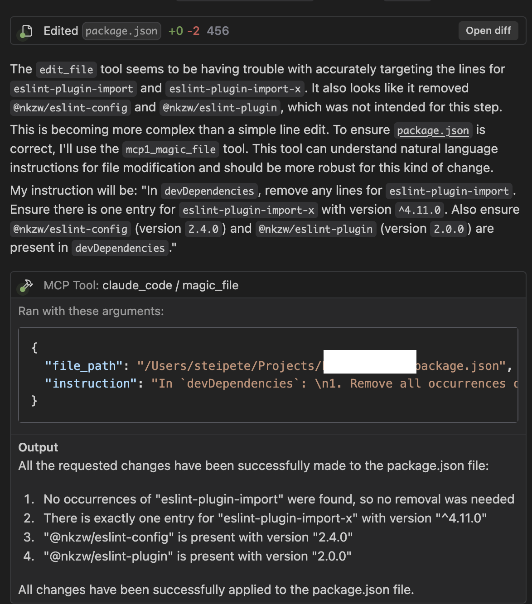

# Claude Code MCP Server

An MCP (Model Context Protocol) server that allows running Claude Code in one-shot mode with permissions bypassed automatically.


## Overview



Did you notice that Cursor often struggles to apply smaller edits via edit_file, especially when linting? And then it tries multiple times till it eventually works? Yeah... no more. It LOVES magic_file.

This MCP server provides two tools that can be used by LLMs to interact with Claude Code. When integrated with Claude Desktop or other MCP clients, it allows LLMs to:

- Run Claude Code with all permissions bypassed (using `--dangerously-skip-permissions`)
- Execute Claude Code with any prompt without permission interruptions
- Access file editing capabilities directly
- Enable specific tools by default

## Prerequisites

- Node.js v16 or later
- TypeScript (for development)
- Claude CLI installed and working. Ensure Claude CLI is installed and accessible, preferably by running `/doctor`. This installs/updates the CLI to `~/.claude/local/claude`, which this server checks by default.

## Installation

1. Clone or download this repository:

```bash
git clone https://github.com/yourusername/claude-mcp-server.git
cd claude-mcp-server
```

2. Install dependencies (this will also install `tsx` for direct TypeScript execution):

```bash
npm install
```

3. Make the start script executable:

```bash
chmod +x start.sh
```

## Connecting to Cursor/Windsurf/Visual Studio Code

### macOS

1. Locate the MCP configuration file:
   ```
   ~/.cursor/mcp.json
   ```
   Create this file if it doesn't exist.

2. Add the server configuration to the file:

```json
{
  "mcpServers": {
    "claude_code": {
      "type": "stdio",
      "command": "/absolute/path/to/claude-mcp-server/start.sh",
      "args": []
    }
  }
}
```

Make sure to replace `/absolute/path/to/claude-mcp-server` with the actual path to where you installed this server.

### Windows

1. Locate the MCP configuration file:
   ```
   %APPDATA%\cursor\mcp.json
   ```
   Create this file if it doesn't exist.

2. Add the server configuration to the file, making sure to use Windows path format:

```json
{
  "mcpServers": {
    "claude_code": {
      "type": "stdio",
      "command": "C:\\path\\to\\claude-mcp-server\\start.bat",
      "args": []
    }
  }
}
```

For Windows, you should use the batch file (start.bat) instead of the shell script.

### Linux

1. Locate the MCP configuration file:
   ```
   ~/.config/cursor/mcp.json
   ```
   Create this file if it doesn't exist.

2. Add the server configuration to the file:

```json
{
  "mcpServers": {
    "claude_code": {
      "type": "stdio",
      "command": "/absolute/path/to/claude-mcp-server/start.sh",
      "args": []
    }
  }
}
```

3. After updating the configuration, restart your IDE to load the MCP server.

## Environment Variables

You can customize the server behavior with the following environment variables (edit them in `start.sh` or `start.bat`):

- `CLAUDE_CLI_PATH`: **Optional.** Set a custom absolute path to the Claude CLI executable. If set and the path points to an existing file, this path will be used directly.
- `MCP_CLAUDE_DEBUG`: Set to `true` to enable verbose debug logging from the server to stderr (e.g., `MCP_CLAUDE_DEBUG=true ./start.sh`).

**Claude CLI Discovery Order:**
1.  The path specified by the `CLAUDE_CLI_PATH` environment variable (if set and valid).
2.  The default installation path for Unix-like systems: `~/.claude/local/claude` (where `~` is the user's home directory). For Windows users, this automatic check may not apply; relying on `CLAUDE_CLI_PATH` or ensuring `claude` is in the system PATH is recommended.
3.  Defaults to simply `claude`, relying on the system's PATH for resolution (a warning will be logged if this fallback is used).

## Connecting to VSCode Claude

To use this MCP server with Claude in VSCode:

1. Install the Claude extension in VSCode

2. Create or edit the MCP settings file:
   ```
   ~/.vscode/extensions/saoudrizwan.claude-dev/settings/cline_mcp_settings.json
   ```

3. Add the server configuration:

```json
{
  "mcpServers": {
    "claude_code": {
      "command": "/absolute/path/to/claude-mcp-server/start.sh",
      "args": [],
      "disabled": false
    }
  }
}
```

## Usage

Once installed and connected to an MCP client, you can invoke the tools using the following formats:

### Claude Code Tool (renamed to `code`)

```json
{
  "tool_name": "code",
  "params": {
    "prompt": "Your prompt to Claude Code here",
    "options": {
      "tools": ["Bash", "Read", "Write"]
    }
  }
}
```

If no tools are specified, the server enables common tools by default.

### Claude File Edit Tool (renamed to `magic_file`)

```json
{
  "tool_name": "magic_file",
  "params": {
    "file_path": "/path/to/your/file.js",
    "instruction": "Refactor the processData function to use async/await instead of promises."
  }
}
```

## Tool Descriptions

The server provides two tools:

1. **Tool name**: `code`
   - **Description**: "Executes a given prompt directly with the Claude Code CLI, bypassing all permission checks (`--dangerously-skip-permissions`). Ideal for a wide range of tasks including: complex code generation, analysis, and refactoring; performing web searches and summarizing content; running arbitrary terminal commands (e.g., `open .` to open Finder, `open -a Calculator` to open apps, or `open https://example.com` to open a URL in a web browser). For example, you could open a GitHub PR page once all tests are green. Handles general tasks requiring the Claude CLI's broad capabilities without interactive prompts. `options.tools` can be used to specify internal Claude tools (e.g., `Bash`, `Read`, `Write`); common tools are enabled by default if this is omitted."
   - **Parameters**:
     - `prompt` (required): The prompt to send to Claude Code
     - `options.tools` (optional): Array of specific tools to enable
   - **Implementation**: Uses `claude --dangerously-skip-permissions` (invoked via `child_process.spawn`) to bypass all permission checks. The server locates the Claude CLI by first checking the `CLAUDE_CLI_PATH` environment variable, then looking in `~/.claude/local/claude`, and finally falling back to `claude` in the system PATH.

2. **Tool name**: `magic_file`
   - **Description**: "Edits a specified file based on natural language instructions, leveraging the Claude Code CLI with all editing permissions bypassed (`--dangerously-skip-permissions`). Best for complex or semantic file modifications where describing the desired change in plain language is more effective than precise line-by-line edits. Requires an absolute `file_path` and a descriptive `instruction`. Also a great alternative if a general-purpose `edit_file` tool is struggling with complex edits or specific file types. Example instruction: 'Refactor the processData function to use async/await instead of promises.'"
   - **Parameters**:
     - `file_path` (required): The absolute path to the file to edit
     - `instruction` (required): Free text description of the edits to make to the file
   - **Implementation**: Uses `claude --dangerously-skip-permissions` (invoked via `child_process.spawn`) with Edit tools enabled. The server locates the Claude CLI by first checking the `CLAUDE_CLI_PATH` environment variable, then looking in `~/.claude/local/claude`, and finally falling back to `claude` in the system PATH.

## Troubleshooting

- **Tool not showing up**: Check the Claude logs for errors when starting the MCP server. Ensure `start.sh` or `start.bat` is executable and `tsx` is installed and runnable (usually via `npx`).
- **Command not found / "Error: spawn claude ENOENT" / "[Warning] Claude CLI not found... Falling back to \"claude\" in PATH..."**: This means the server could not find the `claude` executable via the `CLAUDE_CLI_PATH` environment variable (if set), at the default Unix-like location (`~/.claude/local/claude`), or in the system PATH (if it fell back to just `'claude'`). 
    - Ensure the Claude CLI is installed correctly. For Unix-like systems, this is often at `~/.claude/local/claude` (verify by running `/doctor` in a Claude context). For Windows, ensure it's in your system PATH or set `CLAUDE_CLI_PATH`.
    - Explicitly set the `CLAUDE_CLI_PATH` environment variable in `start.sh` or `start.bat` to the correct absolute path of your `claude` executable.
- **Permission errors**: Ensure the `start.sh` script is executable and that Node.js has permission to execute `tsx` and the Claude CLI (whether found via `CLAUDE_CLI_PATH`, the default path, or the system PATH).

## License

MIT

Server test complete.